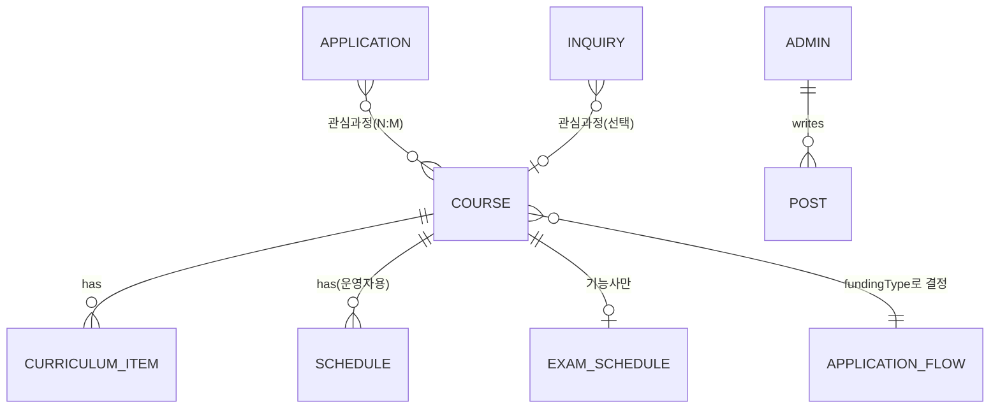

# 성요셉목수학교 웹사이트 리뉴얼 — 데이터정의서 (v2, build-ready)

| 항목 | 내용 |
| --- | --- |
| 문서 | 데이터정의서 (Data Spec) — 개발용 |
| 기준 | 실제 과정 데이터 + 최신 결정(회원 미도입·취업률 미표시·모집상태 수동·개강일 사용자 미표시) |
| 비고 | 초기 04_데이터정의서를 대체하는 최신 버전 |
| 버전 | v2.0 |

---

## 1. ERD (개념)

> 핵심: **Course.fundingType → ApplicationFlow가 결정**된다. 회원(User) 엔티티는 없다(회원제 미도입). 취업률 필드는 없다(미집계).

---

## 2. Enum 정리

| Enum | 값 |
| --- | --- |
| fundingType | 경기도무료 · 국비지원 · 자부담 |
| applicationFlowType | A · B · C (경기도무료→A, 국비지원→B, 자부담→C) |
| courseCategory | 집수리 · 건축목공입문 · 인테리어필름입문 · 기능사 |
| schedulePattern | 평일주간 · 주말 |
| recruitStatus | 모집예정 · 모집중 · 마감 (운영자 수동) |
| Application.status | 신규 · 상담중 · 등록확인 · 보류 |
| Inquiry.category | 국비지원 · 과정문의 · 기타 |
| Inquiry.status | 답변대기 · 답변완료 |
| examType | 건축목공기능사 · 건축도장기능사 |
| Post.category | 훈련사진 · 수강일지 · 수료식 |

---

## 3. Course — 과정 (핵심)

| 필드 | 타입 | 필수 | 설명 |
| --- | --- | --- | --- |
| id | string | ✅ | 고유 식별자 |
| name | string | ✅ | 과정명 |
| category | enum | ✅ | courseCategory |
| schedulePattern | enum | ⬜ | 평일주간 / 주말 |
| **fundingType** | enum | ✅ | 경기도무료 / 국비지원 / 자부담 → 신청 흐름 결정 |
| summary | string | ⬜ | 한 줄 설명 |
| skills | string[] | ⬜ | 스킬 태그(벽설치·타일·욕실시공 등) |
| sessionsTotal | number | ⬜ | 총 회차 |
| sessionHours | string | ⬜ | 회차당 시간(예: 8H) |
| durationText | string | ⬜ | 교육기간 표기 |
| tuition | string | ⬜ | 교육비(없으면 "상담 안내") |
| selfPay | string | ⬜ | 자비부담금(개인별 상이 → "상담 안내" 가능) |
| curriculum | CurriculumItem[] | ⬜ | 회차별(§4) |
| **seoKeywords** | string[] | ⬜ | 과정별 SEO 키워드(오가닉 유입 채널) |
| recruitStatus | enum | ✅ | 운영자 수동. 개강일·잔여석은 사용자에게 미표시 |
| examScheduleId | string | ⬜ | 자부담 기능사만 → ExamSchedule |
| isDeleted | boolean | ✅ | 소프트 삭제 |
| createdAt / updatedAt | datetime | ✅ | |

### 실제 과정 인스턴스 (시드)

| 과정 | category | fundingType | flow | 회차 | 비용·자부담 | 커리큘럼 |
| --- | --- | --- | --- | --- | --- | --- |
| 인테리어목수 무료 | 건축목공입문 | 경기도무료 | A | 입문 NCS | 무료(전액지원) | 입문 커리큘럼 |
| 평일 건축목공 입문 | 건축목공입문 | 국비지원 | B | 20회×8H | 자부담 상담안내 | Image 5 |
| 주말 건축목공 입문 | 건축목공입문 | 국비지원 | B | 16회×8H | 자부담(참고 455,540, 개인별 상이) | Image 6 |
| 주말 인테리어필름 입문 | 인테리어필름입문 | 국비지원 | B | 18회×8H | 자부담(참고 355,540, 개인별 상이) | Image 7 |
| 친환경 집수리 | 집수리 | 국비지원 | B | 28회×8H | 자부담(참고 780,170, 개인별 상이) | Image 3·4 |
| 건축목공기능사 | 기능사 | 자부담 | C | 총 5회 | 600,000원 | 속성대비반 + 시험일정 |
| 건축도장기능사 | 기능사 | 자부담 | C | 총 2회 | 300,000원 | 속성대비반 + 시험일정 |

> ⚠️ "무료(경기도)" 과정과 "국비 평일목공"이 동일 커리큘럼일 수 있어 운영자 확인 필요. 자부담금 참고값은 내일배움카드 보유자 기준·개인별 상이 → 화면은 "상담 안내" 권장.

---

## 4. CurriculumItem — 회차 (Course에 내포)

| 필드 | 타입 | 설명 |
| --- | --- | --- |
| round | number | 회차 |
| unit | string | 능력단위(예: 전동공구 사용실무) |
| content | string | 훈련내용 |
| hours | string | 시간(8H) |
| place | enum | 강의실 / 실습실 |

출처: 집수리 28회차(Image 3·4), 평일 건축목공 20회차(Image 5), 주말 건축목공 16회차(Image 6), 주말 필름 18회차(Image 7).

---

## 5. ApplicationFlow — 신청 절차 (fundingType별 설정값)

DB 행이 아니라 **유형별 고정 설정(config)**으로 둔다.

| 유형 | 진행순서 | 외부/접수 |
| --- | --- | --- |
| **A 경기도무료** | ① 신청서 접수(방문/이메일) ② 면접 ③ 선발자 발표(개별 문자/홈페이지·블로그) ④ 훈련 참여 | 방문접수(예약필수 ☎032-678-3650) / 이메일 yoseph2018@naver.com / 신청서 다운로드 |
| **B 국비지원** | ① 학원 전화로 등록여부 확인 ② 방문·전화 가등록 ③ 고용24에서 수강신청+자비부담금 결제 ④ 등록완료 | 고용24(외부) |
| **C 자부담 기능사** | ① 학원 전화로 등록여부 확인 ② 방문·전화 등록신청 ③ 본인이 큐넷에서 시험장·시험일자 선택·접수 | 큐넷(외부) https://www.q-net.or.kr |

---

## 6. ExamSchedule — 기능사 시험일정 (참고 데이터, 큐넷)

자부담 기능사 과정 상세에 표시. **시험은 큐넷 주관(외부)**, 학원은 실기 대비.

| 필드 | 타입 | 설명 |
| --- | --- | --- |
| id | string | 고유 식별자 |
| examType | enum | 건축목공기능사 / 건축도장기능사 |
| round | string | 회별(제1~4회) |
| applyPeriod | string | 실기 원서접수 기간 |
| examDate | string | 실기시험일 |
| resultDate1 / resultDate2 | string | 합격자 발표(1차/2차) |
| year | number | 2026 |

예시(2026 건축목공기능사 제1회): 원서접수 02.02~02.05, 실기 03.14~04.01, 발표 1차 04.10·2차 04.17. (도장기능사는 제1~4회)

> 참고: 원서접수는 첫날 10:00~마지막날 18:00, 주말·공휴일·공단창립기념일(3.18) 접수 불가.

---

## 7. Schedule — 개강일정 (운영자용)

| 필드 | 타입 | 설명 |
| --- | --- | --- |
| id | string | 고유 식별자 |
| courseId | string | 연결 과정(FK) |
| openDate | date | 개강일 |
| note | string | 비고 |

> 결정 반영: **사용자 화면에는 미표시.** "개강일·잔여석은 신청 시 안내"(운영자 관리·상담용).

---

## 8. Application — 수강신청 / 가등록 (사이트 폼)

| 필드 | 타입 | 필수 | 설명 |
| --- | --- | --- | --- |
| id | string | ✅ | |
| name | string | ✅ | 이름 |
| phone | string | ✅ | 연락처 |
| selectedCourses | string[] | ✅ | 관심/신청 과정(체크, N:M) |
| additionalNote | string | ⬜ | 추가문의 |
| status | enum | ✅ | 신규 / 상담중 / 등록확인 / 보류 |
| adminMemo | string | ⬜ | 상담 메모 |
| privacyAgreed | boolean | ✅ | 개인정보 동의 |
| createdAt / updatedAt | datetime | ✅ | |

> A(경기도무료)는 자필 서식 이메일/방문 접수라 **사이트 Application을 생성하지 않고 안내만** 한다. B·C는 이 폼이 "가등록 문의"로 동작 → 전화상담으로 이어짐. 비로그인 처리(회원 미도입).

---

## 9. Inquiry — 상담문의 (Q&A)

| 필드 | 타입 | 필수 | 설명 |
| --- | --- | --- | --- |
| id | string | ✅ | |
| name | string | ✅ | 이름 |
| phone | string | ✅ | 연락처 |
| category | enum | ✅ | 국비지원 / 과정문의 / 기타 |
| courseId | string | ⬜ | 관심 과정(선택) |
| title | string | ⬜ | 제목 |
| content | string | ✅ | 문의 내용 |
| status | enum | ✅ | 답변대기 / 답변완료 |
| answer | string | ⬜ | 답변(전화 처리 시 메모) |
| privacyAgreed | boolean | ✅ | 동의 |
| createdAt / updatedAt | datetime | ✅ | |

> 참고: 기존 폼은 생년월일을 받았으나(민감정보) 수집 최소화 검토 권장(정책정의서 §8).

---

## 10. Post / History / Admin

**Post (게시글·훈련사진)**: id, category(훈련사진/수강일지/수료식), title, content, images[], isPublished, isDeleted, timestamps.

**History (연혁)** — 학원소개 화면 콘텐츠: id, year, items. 2018 설립 ~ 2025 고용노동부 3년인증 등(Image 1). → 트랜잭션 데이터가 아닌 **콘텐츠**, CMS/정적 관리 가능.

**Admin (관리자)**: id, loginId, passwordHash(해시 저장), name, timestamps.

---

## 11. 데이터 vs 화면 콘텐츠 구분

| 데이터로 관리 | 화면 콘텐츠(참고) |
| --- | --- |
| Course·CurriculumItem·ExamSchedule·Schedule·Application·Inquiry·Post | 연혁(History), "국비훈련생 등록절차" 인포그래픽 등 마케팅/안내 이미지 |

> 커리큘럼·시험일정은 화면에도 쓰이지만 **구조화된 데이터**로 관리한다(이미지 아님). 순수 안내·마케팅 이미지는 데이터 모델에 넣지 않는다.

---

## 12. 결정 반영 체크

- ❌ User(회원) 엔티티 없음 — 회원제 미도입
- ❌ 취업률 필드 없음 — 미집계
- recruitStatus 운영자 수동 / 개강일 사용자 미표시
- fundingType이 신청 흐름(A·B·C)을 구동
- 모든 삭제는 소프트 삭제, 개인정보(name·phone)는 접근권한·보유기간 정책 적용(정책정의서 §8)
