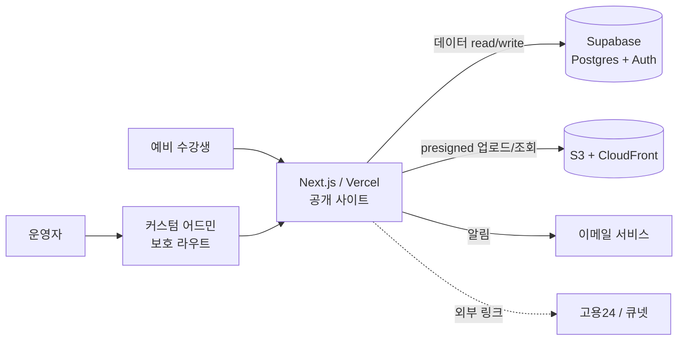

# 성요셉목수학교 웹사이트 리뉴얼 — 엔지니어링 설계서

| 항목 | 내용 |
| --- | --- |
| 문서 | 엔지니어링 설계서 (Tech Stack & Architecture) |
| 확정 스택 | Next.js + Supabase(Postgres·Auth) + S3 + **직접 만든 어드민** |
| 전제 | 프론트엔드 1인 개발 + 비개발자 운영자 / 소규모 트래픽 |
| 선행 | 데이터정의서 v2 · 화면정의서 v2 · 정책 결정 |
| 비고 | 요금·한도는 각 서비스 공식 문서 확인 |

---

## 1. 기술 선택을 좌우하는 요구사항

| 요구사항 | 기술적 함의 |
| --- | --- |
| SEO(과정별 organic 유입이 핵심 채널) | SSR/SSG/ISR + 메타·구조화 데이터 |
| 비개발자 운영자가 직접 관리 | **운영자 어드민을 직접 구축** |
| 신청/문의/대기 데이터 + 상태관리 | Postgres + 어드민 CRUD + 상태 필드 |
| 회원제·온라인 결제 없음 | 사용자 인증·PCI 불필요 → 단순·안전 |
| 고용24·큐넷은 외부 링크 | 연동 없음(링크만) |
| 모바일 우선 | 반응형·이미지 최적화 |
| 자필 서식(Type A)은 이메일 접수 | 사이트에 민감정보 저장 안 함 |

---

## 2. 확정 스택

| 영역 | 선택 | 이유 |
| --- | --- | --- |
| 프론트엔드 | **Next.js(App Router) + TS + Tailwind** | SEO·라우팅·이미지 최적화, 본인 강점 |
| DB | **Supabase (PostgreSQL)** | 관계형, 자동 API, 익숙함 |
| 인증 | **Supabase Auth (관리자만)** | 회원 없음 → admin 계정만 |
| 파일 저장 | **S3 (+ CloudFront 권장)** | 훈련사진 등 이미지, CDN 전송 |
| 어드민 | **직접 구축 (Next 보호 라우트)** | 풀 컨트롤(A·B·C·대기신청 로직), 의존성·러닝커브 없음 |
| 폼 처리 | Server Actions + zod | 서버 검증·제출 |
| 이메일 알림 | Resend 등 | 신청·문의 운영자 알림 / Type A 접수 안내 |
| 호스팅 | Vercel(Next) + Supabase | 간단 배포 |

> CMS(Payload 등)를 쓰지 않고 **직접 어드민을 만드는** 선택. 작업량은 늘지만 커스텀 로직 자유도와 익숙한 스택 유지가 이점.

---

## 3. 아키텍처

- 공개 사이트: 콘텐츠는 ISR로 Supabase에서 fetch(SEO), 폼은 Server Action으로 제출
- 어드민: 같은 Next 앱의 보호 라우트(`/admin/*`), Supabase Auth로 인증
- 이미지: 어드민에서 presigned URL로 S3 직접 업로드, 키를 Supabase에 저장

---

## 4. 렌더링·SEO 전략

| 페이지 | 방식 | 이유 |
| --- | --- | --- |
| 홈·학원소개·국비지원 | SSG/ISR | 정적·SEO |
| 과정 목록·상세 | **ISR** | organic 유입 핵심 → 메타·JSON-LD(Course) |
| 훈련 사진 | ISR + lazy-load | 이미지 최적화 |
| 상담문의 리스트 | SSR/ISR | 최신 반영 |
| 폼(수강신청·문의·대기) | CSR + Server Action | 입력·검증·제출 |
| 어드민 `/admin/*` | CSR(보호) | 운영자 전용 |

---

## 5. 데이터 → Supabase 테이블 매핑

| 구분 | 테이블 |
| --- | --- |
| 콘텐츠 | course(+curriculum_item) · exam_schedule · post · history · popup · schedule |
| 제출 | application(가등록/수강신청) · inquiry(상담) · waitlist(대기신청) |
| 인증 | Supabase Auth(관리자) |

- course.funding_type → 프론트에서 신청 흐름(A·B·C) 조건 렌더
- 이미지: post.images = S3 객체 키/URL 배열
- 상세 필드는 데이터정의서 v2 참조

---

## 6. 직접 만드는 어드민 — 작업 범위

`/admin/*` 보호 라우트. 운영자(비개발자)가 쓸 화면.

| 화면 | 기능 |
| --- | --- |
| 로그인 | Supabase Auth |
| 대시보드 | 신규 신청·문의·모집중 과정 요약 |
| 과정 관리 | CRUD + 모집상태 토글 + 커리큘럼 편집 + S3 이미지 업로드 |
| 개강일정 관리 | CRUD(운영자 내부용, 사용자 미표시) |
| 신청 관리 | 목록·상태 전이(접수→상담중→등록확인/보류) + 메모 + 엑셀 다운로드 |
| 대기신청 관리 | 마감 과정 대기자 목록·연락 |
| 문의 관리 | Q&A 답변대기→답변완료 |
| 게시판(훈련사진) 관리 | CRUD + S3 다중 이미지 |
| 팝업/배너 관리 | 노출 기간·순서·활성 |

> 어드민 공통: 목록(페이지네이션·검색·필터), 폼 검증, 저장/삭제 확인, 토스트. 작업량이 적지 않으니 컴포넌트(테이블·폼)를 재사용 가능하게 설계.

---

## 7. 보안·개인정보 — Supabase RLS (가장 중요)

RLS(Row Level Security)를 반드시 설정한다. 미설정 시 신청자 개인정보가 공개 노출될 수 있다.

| 테이블 | 공개(anon) | 관리자(authenticated) |
| --- | --- | --- |
| course·post·history·popup·curriculum·exam_schedule | SELECT(게시된 것만) | ALL |
| schedule | (미표시) 없음 | ALL |
| application·inquiry·waitlist | **INSERT만** | SELECT·UPDATE·DELETE |

> 원칙: **공개는 게시 콘텐츠 읽기 + 폼 쓰기만, 개인정보가 든 제출 테이블의 읽기·수정은 관리자만.** (정책정의서 §8)

기타: 사용자 인증 없음(공격면↓) · HTTPS · 폼 스팸 방지(rate limit·허니팟·필요 시 캡차) · 자필 서식은 사이트 미저장(이메일 접수).

---

## 8. 배포·운영

- Vercel: Git 연동 자동 배포·프리뷰
- Supabase: 관리형 Postgres·Auth, 정기 백업 확인
- S3 + CloudFront: 이미지 CDN, 버킷 권한(공개 읽기/관리 업로드) 구분
- 도메인 연결, `sitemap.xml`·`robots.txt`·구조화 데이터
- 운영자 온보딩: 어드민 사용 가이드(과정·신청자·문의 관리)

---

## 9. 구현 순서 (MVP)

1. Next.js + Tailwind 셋업, 디자인 토큰
2. Supabase 프로젝트 + 테이블 + **RLS 정책** + 시드 데이터 투입
3. 공개 정적 페이지(홈·학원소개·국비지원) SSG
4. 과정 목록·상세(ISR) + 과정별 SEO 메타·JSON-LD
5. 폼(수강신청/문의/대기) + Server Action + zod + 이메일 알림
6. S3 업로드(presigned) + 훈련 사진 갤러리(라이트박스)
7. **어드민 구축**(로그인→대시보드→과정→신청→문의→게시판→팝업)
8. 배포·도메인·사이트맵·운영자 온보딩

---

## 10. 결정 필요 / 2차

| # | 항목 | 비고 |
| --- | --- | --- |
| 1 | DB 접근: Supabase client vs Prisma | 마이그레이션·타입 원하면 Prisma |
| 2 | 어드민 권한 | MVP는 단일 관리자, 권한 분리는 2차 |
| 3 | 과정별 SEO 자동 생성 | organic 핵심 → 우선순위 상향 검토 |
| 4 | 대기신청(Waitlist) 운영 흐름 | 마감 과정 대기자 관리 방식 정의 |

> 2차: 고용24·큐넷 연동, 통계 대시보드, 문의 자동 요약·FAQ 생성 등(데이터 구조화로 재설계 없이 확장 가능).
